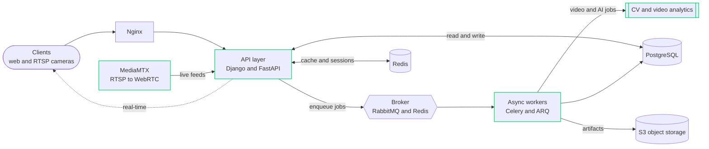

<!-- ============================ HEADER ============================ -->

> **I lead the Python backend at a computer-vision product company** — designing the async, streaming, and data layers that production AI workloads run on. By night, I write novels and cut short films.

---

## The request path

The way I think about a production backend: **keep the request path thin, push everything heavy off it.**

> Live camera feeds and AI analytics surface in real time, while video-processing and ML jobs stay off the request path. This is the shape of the **Video Management System** and **Ikshana** work I own at Intozi.

---

## By the numbers

<table>
<tr>
<td align="center" width="20%">

### `4`
**backends** shipped · open-source

</td>
<td align="center" width="20%">

### `73`
**REST routes** HeadTogether

</td>
<td align="center" width="20%">

### `20`
**ORM tables** layered repos

</td>
<td align="center" width="20%">

### `16`
**Ansible roles** idempotent · CIS

</td>
<td align="center" width="20%">

### `🏆`
**KAVACH'23** Govt. of India

</td>
</tr>
</table>

---

## At Intozi  ·  Jun 2024 – present

Lead backend at a computer-vision & video-analytics **product** company. I own the Python services across the products and coordinate delivery within a small team.

> [!NOTE]
> **Currently building** the backend for a client-facing **Video Management System** — Django services with **MediaMTX** wired in for RTSP/WebRTC, so live camera feeds and AI analytics surface in the app in real time.

- **Own the Python services** across the company's products, including **Ikshana**, its core video-analytics product.
- **Architected the data & async layers** — `PostgreSQL` · `Redis` · `RabbitMQ` · `Celery` — to run video-processing jobs and AI workloads off the request path for responsive, scalable services.
- **Built an internal MLOps pipeline** (Django + React): dataset upload → auto-labeling → human verification → training/retraining, with a path to client-facing deployment.

---

## Selected systems

Four backends I designed and shipped end-to-end — deeper write-ups live in each repo.

| Project | What it is | Built with |
|---|---|---|
| **[Papyrus](https://github.com/Akshat-Pandey16/papyrus)** | Self-hostable, privacy-first PDF studio — merge / split / compress / OCR with a zero-retention TTL | `FastAPI` · `Celery` · `S3` · `Compose + Helm` |
| **[HeadTogether](https://github.com/Akshat-Pandey16/HeadTogether)** | Geo-bounded, ephemeral chat rooms discoverable only by people physically nearby | `FastAPI` · `WebSockets` · `Redis pub/sub` · `Argon2id` |
| **[ShieldBuntu](https://github.com/Akshat-Pandey16/ShieldBuntu)** | One-click Ubuntu CIS hardening — apply / dry-run / revert, streamed live to the UI | `FastAPI` · `Ansible` · `SSE` · `PAM` |
| **[MeshHawk](https://github.com/Akshat-Pandey16/MeshHawk)** | Local-first 802.11 mesh detector — `.pcap` in, topology graph + SVG report out | `FastAPI` · `scapy` · `NetworkX` · `ARQ` |

---

## Toolbox

| | |
|---|---|
| **Languages** | Python · Bash |
| **Frameworks** | Django · FastAPI |
| **Data & async** | PostgreSQL · Redis · RabbitMQ · Celery · ARQ |
| **Streaming & real-time** | MediaMTX (RTSP/WebRTC) · WebSockets · Server-Sent Events |
| **Infra** | Docker · Kubernetes/Helm · Nginx · AWS · Linux · Git |

---

## Beyond the terminal

Engineering isn't the only thing I ship. I'm a published **author** — a novelette and **two novels** — and I **shoot and edit short films**. Both are the same discipline as backend work: structure, revision, pacing, and deciding what to leave out.

### Recognition and education

- 🏆 **KAVACH'23** — Winner of the inaugural **nationwide** cybersecurity hackathon organised by the **Government of India**.
- 🎓 **B.Tech, Computer Science** — Bhilai Institute of Technology, Durg · **CPI 9.68** (2020 – 2024).

---

## GitHub activity

---

## Connect

[-000000?style=for-the-badge&logo=x&logoColor=white&labelColor=00d668)](https://twitter.com/akshatpandey160)

 

<i>Thin request path. Heavy lifting off to the side. Same goes for the README — thanks for scrolling.</i>

