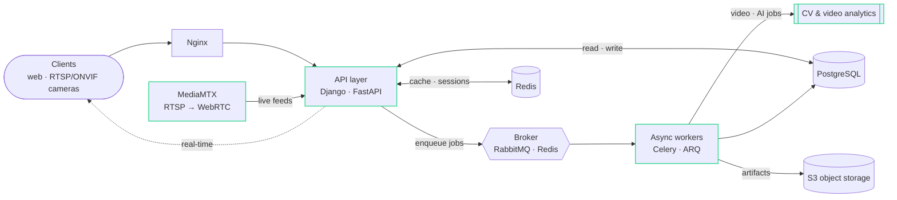

```console
visitor@akshat:~$ neofetch
```
```diff
+                   -++++@@@@@@+-                     akshat@github
+                  -@@@@@@@@@@@@@@=                   ────────────────────────
+                  =@@@@@@@@@@@@@@@%.                 Role     Data Platform Engineer
+                 =@@%     +@@@@@@@@#                 Host     Intozi Tech · video AI
+                 =@@@      :--=: -@%                 Uptime   2 yrs · since 2020
+                 .@@=  .==+: --==:@*                 Focus    ingest · pipelines · MLOps
+                 .%% .*+@@@@#@@@@*%#                 Langs    Python · SQL · Bash · TS
+                 *=.  :-=+=. -===-+#                 Stack    FastAPI · Django · Postgres
+                  ..    :%+++=*-  -#                 Async    Celery · RabbitMQ · Redis
+                       *@@@@@@%@@-#:  :              Stream   MediaMTX · WebRTC · ONVIF
+                    .: =%+:..-#@@-@.            .::  ML       scikit-learn · scapy
+                     #@%   -#--=@@=             :.   Infra    Docker · K8s · AWS · Linux
+                      #@*++=+==*@=.     : :  . .     Edu      B.Tech CS · CPI 9.68
+                 -=    #@@@@@@@%*        ..    ::    Award    KAVACH'23 · Govt. of India
+      :      .=%@@@%=   #@@@@@-.#+.         .. :-::  Base     Gurugram, IN · remote
+  .  -     =%@@@@@@@@%= -@@@@- .@@@@+=..  ..   :  =  Status   ● open to work
+     : ==*@@@@@@@@@@@@@@@@#++:=@@@@@@@@%+*.   .= -+
+     =%@@@@@@@@@@@@@@@@@@@@%%@@@@@@@@@@@@@@%= :  .:
+   :*@@@@@@@@@@@@@@@@@@@@@@@@@@@@@@@@@@@@@@@@- .::.
+ .*@@@@@@@@@@@@@@@@@@@@@@@@@@@@@@@@@@@@@@@@@@%=-:-:
+ #@@@@@@@@@@@@@@@@@@@@@@@@@@@@@@@@@@@@@@@@@@@@%:**
```

```console
visitor@akshat:~$ whoami
```
```diff
+ I build the data & streaming platform behind a computer-vision product —
+ camera ingestion, async pipelines, and the MLOps loop that keeps production
+ models fed. I keep the request path thin and push everything heavy off it.
+ By night I write novels and cut short films.
```

```console
visitor@akshat:~$ cat architecture.txt     # keep the request path thin, push the heavy work off it
```


```console
visitor@akshat:~$ cat ~/intozi/role.md     # Data Platform Engineer · Jun 2024 – present
```

Data platform / backend for a computer-vision & video-analytics **product** company. I own the Python services across the product line.

- **Architected the data & async layer** — `PostgreSQL` · `Redis` · `RabbitMQ` · `Celery` — so video-processing and model-inference jobs run off the request path for responsive, scalable services.
- **Built the live-video ingest** for a client-facing **Video Management System** — Django services with **MediaMTX** wired in for RTSP/WebRTC, so camera feeds and AI analytics surface in the app in real time.
- **Built an internal MLOps pipeline** (Django + React): dataset upload → auto-labeling → human verification → training/re-training, with a path to client-facing deployment.

```console
visitor@akshat:~$ ls ~/projects
onveef/   papyrus/   meshhawk/   hoctor/   fosslove/   headtogether/   shieldbuntu/
visitor@akshat:~$ cat ~/projects/*/README.md | head
```

| Project | What it is | Built with |
|---|---|---|
| **[onveef](https://github.com/Akshat-Pandey16/onveef)** | A fast, zeep-free ONVIF client library for IP cameras — discover devices, pull stream URLs, drive PTZ; sans-IO core, imports instantly | `Python` · `httpx` · `sans-IO` |
| **[Papyrus](https://github.com/Akshat-Pandey16/papyrus)** | Self-hostable, privacy-first PDF studio on an async job pipeline — merge / split / compress / OCR with a zero-retention TTL | `FastAPI` · `Celery` · `Redis` · `S3` |
| **[MeshHawk](https://github.com/Akshat-Pandey16/MeshHawk)** | Local-first 802.11 mesh detector — `.pcap` in, topology graph + SVG report out | `FastAPI` · `scapy` · `NetworkX` · `ARQ` |
| **[Hoctor](https://github.com/Akshat-Pandey16/Hoctor)** | Indoor Wi-Fi fingerprint localization — a per-venue random forest predicts the room from surrounding APs | `Django` · `DRF` · `scikit-learn` |
| **[FOSSLove](https://github.com/Akshat-Pandey16/fosslove)** | A FOSS app catalog that builds one cross-distro install script (apt / dnf / pacman / flatpak / winget) | `FastAPI` · `PostgreSQL` · `Redis` · `Next.js` |
| **[HeadTogether](https://github.com/Akshat-Pandey16/HeadTogether)** | Geo-bounded, ephemeral chat rooms discoverable only by people physically nearby | `FastAPI` · `WebSockets` · `Redis` · `Argon2id` |
| **[ShieldBuntu](https://github.com/Akshat-Pandey16/ShieldBuntu)** | One-click Ubuntu CIS hardening — 16 idempotent Ansible roles, apply / dry-run / revert, streamed live | `FastAPI` · `Ansible` · `SSE` · `PAM` |

```console
visitor@akshat:~$ cat ~/toolbox.md
```
```diff
+ languages    Python · SQL · Bash · TypeScript
+ frameworks   FastAPI · Django · React
+ data & async PostgreSQL · Redis · RabbitMQ · Celery · ARQ
+ ingest       MediaMTX (RTSP/WebRTC) · ONVIF · WebSockets · Server-Sent Events
+ ml & data    scikit-learn · scapy · NetworkX
+ infra        Docker · Kubernetes/Helm · Nginx · AWS · Linux · Git
```

```console
visitor@akshat:~$ cat ~/recognition.md
```
```diff
+ 🏆  KAVACH'23  — Winner, inaugural nationwide cybersecurity hackathon (Government of India)
+ 🎓  B.Tech Computer Science — Bhilai Institute of Technology, Durg · CPI 9.68 (2020–2024)
```

```console
visitor@akshat:~$ cat ~/offline.md         # engineering isn't the only thing I ship
```
```diff
+ A published author — a novelette and two novels — and I shoot & edit short films.
+ Same discipline as backend work: structure, revision, pacing, deciding what to cut.
```

```console
visitor@akshat:~$ cat ~/contact.txt
```

- **Portfolio** — https://akshat16pandey.netlify.app/
- **LinkedIn** — https://www.linkedin.com/in/akshat16pandey/
- **Email** — akshat16pandey@gmail.com
- **GitHub** — https://github.com/Akshat-Pandey16

```console
visitor@akshat:~$ exit
logout
```

<sub><i>Thin request path. Heavy lifting off to the side. Same goes for the README — thanks for scrolling.</i></sub>
